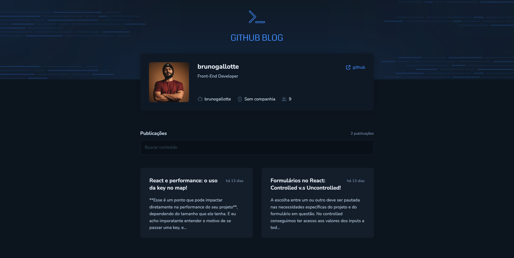

<h1 align="center">
    # Github Blog
</h1>

  <a href="#-tecnologias">Tecnologias</a>&nbsp;&nbsp;&nbsp;|&nbsp;&nbsp;&nbsp;
  <a href="#-projeto">Projeto</a>&nbsp;&nbsp;&nbsp;|&nbsp;&nbsp;&nbsp;
  <a href="#-layout">Layout</a>&nbsp;&nbsp;&nbsp;|&nbsp;&nbsp;&nbsp;
  <a href="#memo-licença">Licença</a>

 

  

 

  

## 🚀 Tecnologias

Esse projeto foi desenvolvido com as seguintes tecnologias:

- [React](https://reactjs.org)
- [TypeScript](https://www.typescriptlang.org/)
- [Styled Components](https://styled-components.com/)

## 💻 Projeto

O projeto foi um desafio do bootcamp de especialização em React.js do Ignite, que propos a revisão e aprendizado dos seguintes temas: Fetch / Axios, Roteamento e React Router DOM, Formulários.

Desenvolvido a partir do protótipo do figma, utilizando ContextAPI para gerenciar o estados globais e axios para requisições, formulário controlado com React Hook Form e validado com Zod. Todos as demandas do desafio foram cumpridas com êxito! Você pode verificar <a href="https://efficient-sloth-d85.notion.site/Desafio-03-Github-Blog-13593953670346908462ddc648d42cf1">clicando aqui </a>

## 🔖 Layout

Nos links abaixo você encontra o layout do projeto web. Lembrando que você precisa ter uma conta no [Figma](http://figma.com/) para acessá-lo.

- [Layout Figma](https://www.figma.com/community/file/1138814951106121051)
- [Vercel](https://github-blog-dcgnfpi34-brunogallotte.vercel.app/)

## :memo: Licença

Esse projeto está sob a licença MIT. Veja o arquivo [LICENSE](LICENSE.md) para mais detalhes.

---
